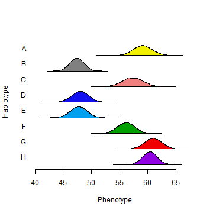
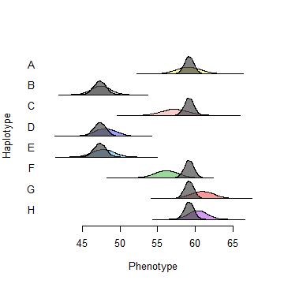
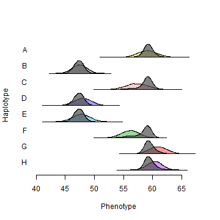
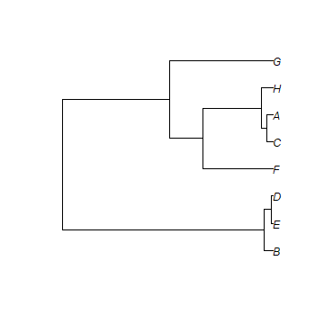
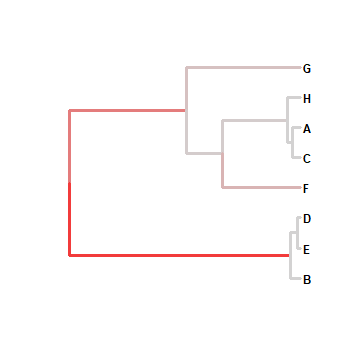
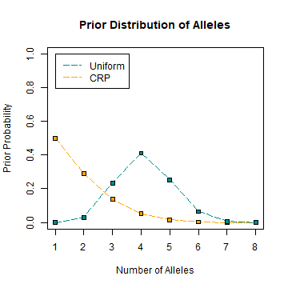

## Overview

TIMBR is an R package for inferring an allelic series of haplotypes at a locus in a multiparental population. This vignette demonstrates how to get started using data from the first example in the [manuscript](https://www.biorxiv.org/content/10.1101/2020.05.23.112326v2).

## Installing from GitHub

```r
devtools::install_github("wesleycrouse/TIMBR", build_vignettes=T)
```

## Loading the package and example data

```r
library(TIMBR)
data(mcv.data)
```

## Formatting data
The input data for TIMBR includes a vector `y` of quantitative trait observations


```r
y <- mcv.data$y
head(y, 10)
```

```
##  [1] 44.6 48.5 46.3 61.5 47.0 60.9 51.7 51.4 55.1 70.5
```

and a list `prior.D` which specifies prior haplotype-pair (diplotype) state probabilities.


```r
prior.D <- mcv.data$prior.D
str(prior.D)
```

```
## List of 3
##  $ P          : num [1:131, 1:36] 3.33e-08 1.12e-04 1.45e-05 1.00e-02 3.68e-08 ...
##   ..- attr(*, "dimnames")=List of 2
##   .. ..$ : NULL
##   .. ..$ : chr [1:36] "AA" "BB" "CC" "DD" ...
##  $ A          : num [1:36, 1:8] 1 0 0 0 0 0 0 0 0.5 0.5 ...
##   ..- attr(*, "dimnames")=List of 2
##   .. ..$ : chr [1:36] "AA" "BB" "CC" "DD" ...
##   .. ..$ : chr [1:8] "A" "B" "C" "D" ...
##  $ fixed.diplo: logi FALSE
```

`prior.D` includes a matrix of diplotype state probabilities `P` for all individuals and an additive design matrix `A` that maps diplotype states to half-counts of haplotype dosages. The option `fixed.diplo=TRUE` fixes each diplotype state to its prior maximum to speed computation. In this example, there are 131 individuals, 36 possible diplotype states, 8 different haplotypes, and diplotype states will be sampled rather than fixed.

The order of rows in `P` must match the order of observations in `y`. When inputting your own data, make sure that `A` is correctly specified to match the order of columns in `P`.  Here, the columns in `P` (and consequently, the rows in `A`) use the default order in 'HAPPY'. For example, the first rows of `A` are:


```r
prior.D$A[1:14,]
```

```
##      A   B   C   D E F G H
## AA 1.0 0.0 0.0 0.0 0 0 0 0
## BB 0.0 1.0 0.0 0.0 0 0 0 0
## CC 0.0 0.0 1.0 0.0 0 0 0 0
## DD 0.0 0.0 0.0 1.0 0 0 0 0
## EE 0.0 0.0 0.0 0.0 1 0 0 0
## FF 0.0 0.0 0.0 0.0 0 1 0 0
## GG 0.0 0.0 0.0 0.0 0 0 1 0
## HH 0.0 0.0 0.0 0.0 0 0 0 1
## AB 0.5 0.5 0.0 0.0 0 0 0 0
## AC 0.5 0.0 0.5 0.0 0 0 0 0
## BC 0.0 0.5 0.5 0.0 0 0 0 0
## AD 0.5 0.0 0.0 0.5 0 0 0 0
## BD 0.0 0.5 0.0 0.5 0 0 0 0
## CD 0.0 0.0 0.5 0.5 0 0 0 0
```

The default order in 'qtl2' is different. To generate an additive design matrix for use with 'qtl2' data, use the function `additive.design`. The row and column names in `P` and `A` are for clarity; they are not used by TIMBR.

## Haplotype-based association

TIMBR requires a prior distribution for the allelic series. To begin, we implement a standard haplotype-based association model that assumes the allelic series is known and that all haplotypes are functionally distinct from one another. 


```r
prior.M.hap <- mcv.data$prior.M$fixed
str(prior.M.hap)
```

```
## List of 2
##  $ model.type: chr "fixed"
##  $ M.IDs     : chr "0,1,2,3,4,5,6,7"
```

`prior.M` is a list where `model.type="fixed"` specifies that the allelic series is fixed to a single value, and `M.IDs="0,1,2,3,4,5,6,7"`specifies an allelic series where all 8 haplotypes are functionally distinct. 

We call TIMBR using this prior and visualize the haplotype effects.


```r
set.seed(84627)
results.hap <- TIMBR(y, prior.D, prior.M.hap, verbose=F)
TIMBR.plot.haplotypes(results.hap)
```
<center>

</center>

We also report the natural log Bayes factor (lnBF) in favor of this model against a null where all haplotypes are functionally identical (i.e. there is no genetic effect).


```r
results.hap$ln.BF
```

```
## [1] 30.25378
```

## Setting the allelic series to a specific value

Based on the previous result, it may be reasonable to assume that the allelic series is actually biallelic, with one functional allele comprised of haplotypes B,D,E and the other allele comprised of the other haplotypes. We can specify this allelic series similarly.


```r
prior.M.biallelic <- list(model.type="fixed", M.IDs="0,1,0,1,1,0,0,0")
```

We call TIMBR assuming this biallelic contrast, report the first ten posterior samples of the haplotype effects, and visualize the haplotype effects against the previous haplotype-based model.


```r
results.biallelic <- TIMBR(y, prior.D, prior.M.biallelic, verbose=F)
results.biallelic$post.hap.effects[1:10,]
```

```
##           [,1]     [,2]     [,3]     [,4]     [,5]     [,6]     [,7]     [,8]
##  [1,] 58.43129 46.23003 58.43129 46.23003 46.23003 58.43129 58.43129 58.43129
##  [2,] 58.87551 46.72605 58.87551 46.72605 46.72605 58.87551 58.87551 58.87551
##  [3,] 59.39938 47.72288 59.39938 47.72288 47.72288 59.39938 59.39938 59.39938
##  [4,] 59.11622 48.73836 59.11622 48.73836 48.73836 59.11622 59.11622 59.11622
##  [5,] 60.06851 46.52514 60.06851 46.52514 46.52514 60.06851 60.06851 60.06851
##  [6,] 59.19687 47.62551 59.19687 47.62551 47.62551 59.19687 59.19687 59.19687
##  [7,] 60.86075 47.19279 60.86075 47.19279 47.19279 60.86075 60.86075 60.86075
##  [8,] 59.22061 48.27640 59.22061 48.27640 48.27640 59.22061 59.22061 59.22061
##  [9,] 59.16915 47.33180 59.16915 47.33180 47.33180 59.16915 59.16915 59.16915
## [10,] 58.36191 48.54553 58.36191 48.54553 48.54553 58.36191 58.36191 58.36191
```

```r
TIMBR.plot.haplotypes(results.biallelic, TIMBR.output.bkgrd=results.hap)
```
<center>

</center>


The posterior samples show that haplotype effects are now identical within alleles. The visualization shows that they are also estimated with more certainty because there are fewer effect parameters (two) than in the haplotype-based model (eight). We also calculate the lnBF in favor of this biallelic model against the previous haplotype-based model.


```r
results.biallelic$ln.BF - results.hap$ln.BF
```

```
## [1] 7.422492
```

In this way, TIMBR can be used for a fully-Bayesian implementation of merge analysis. See the manuscript for more details.

## Modeling the allelic series with a uniform prior distribution

Often, we do not expect all haplotypes to be functionally distinct, but we also do not know the correct allelic series configuration with certainty. Using TIMBR, we can set a prior distribution over all possible allelic series configurations and estimate a posterior distribution. A naive first approach is to assume a uniform distribution where all allelic series are equally likely *a priori*. This is specified as 


```r
prior.M.uniform <- mcv.data$prior.M$uniform
str(prior.M.uniform)
```

```
## List of 1
##  $ model.type: chr "uniform"
```

We call TIMBR assuming a uniform prior distribution and report the top ten posterior allelic series.


```r
results.uniform <- TIMBR(y, prior.D, prior.M.uniform, verbose=F)
as.matrix(head(results.uniform$p.M.given.y, 10))
```

```
##                   [,1]
## 0,1,2,1,1,2,0,0 0.1404
## 0,1,0,1,1,0,2,2 0.0602
## 0,1,0,1,1,2,0,0 0.0573
## 0,1,0,1,1,0,0,0 0.0445
## 0,1,2,1,1,3,0,0 0.0444
## 0,1,2,1,1,2,3,3 0.0346
## 0,1,2,1,1,0,2,2 0.0255
## 0,1,0,1,1,2,3,3 0.0254
## 0,1,2,1,1,2,3,0 0.0242
## 0,1,2,1,1,2,0,3 0.0192
```

The top allelic series configuration has three functional alleles (A,G,H vs. B,D,E vs. C,F), the biallelic contrast from the previous section is ranked fourth, and posterior certainty is generally low.

## Modeling the allelic series with a Chinese restaurant process prior distribution

A uniform distribution over allelic series implies a strong prior belief in an intermediate number of alleles, but this is unreasonable, for example, if we have a prior expectation that many allelic series are biallelic. TIMBR implements a flexible prior distribution over allelic series called a Chinese restaurant process (CRP). The CRP has a concentration parameter $\alpha$ that controls the prior number of functional alleles. At the limits, $\alpha=0$ implies a null model with only one functional allele, and $\alpha=\infty$ implies the haplotype-based model where all haplotypes are functionally distinct. The approach used in the manuscript places a gamma prior distribution on the concentration parameter with the following parameters.


```r
prior.M.crp <- mcv.data$prior.M$crp
str(prior.M.crp)
```

```
## List of 4
##  $ model.type       : chr "crp"
##  $ prior.alpha.type : chr "gamma"
##  $ prior.alpha.shape: num 1
##  $ prior.alpha.rate : num 2.33
```
It is also possible to set $\alpha$ to a fixed value, see `mcv.data$prior.M$crp.fixed` for an example.

We call TIMBR using the CRP and this gamma prior distribution for the concentration parameter and report the top ten posterior allelic series.


```r
results.crp <- TIMBR(y, prior.D, prior.M.crp, verbose=F)
as.matrix(head(results.crp$p.M.given.y, 10))
```

```
##                   [,1]
## 0,1,0,1,1,0,0,0 0.5714
## 0,1,0,1,1,2,0,0 0.0801
## 0,1,2,1,1,2,0,0 0.0612
## 0,1,0,1,1,0,2,2 0.0246
## 0,1,0,1,1,0,2,0 0.0202
## 0,1,0,2,1,0,0,0 0.0196
## 0,1,2,1,1,0,0,0 0.0173
## 0,1,0,1,2,0,0,0 0.0171
## 0,1,0,2,2,0,0,0 0.0158
## 0,1,0,1,1,0,0,2 0.0148
```

The biallelic contrast from earlier is now the top posterior allelic series with over 50% probability. This is because our prior distribution places considerable weight on smaller numbers of functional alleles. We also visualize the haplotype effects against haplotype-based approach from earlier.


```r
TIMBR.plot.haplotypes(results.crp, TIMBR.output.bkgrd=results.hap)
```

<center>

</center>

The haplotype effects using the CRP are again more certain, but they retain long tails that span much of the range of the effect estimates from the haplotype-based model.

## Computing the prior distribution with Ewens's sampling formula

The CRP implicitly assumes that the haplotypes are equally related and that the relationship between them is unknown. Specifically, Ewens's sampling formula describes the CRP as the distribution over partitions (i.e. allelic series) induced by functional mutations on an unknown coalescent tree with the haplotypes at the leaves. TIMBR leverages this relationship to define a prior distribution for the allelic series that is conditional on a single tree (or set of trees), rather than an unknown coalescent tree. 

The example data includes samples of coalescent trees at the causal locus for this QTL in `mcv.data$trees`. This is an object of class `multiphylo`, which is defined by the 'ape' package. We visualize the first tree sample using 'ape'.


```r
library(ape)
trees <- mcv.data$trees
plot.phylo(trees[[1]])
```

<center>

</center>

The tree indicates that haplotypes B,D,E are more closely related to each other and then the other haplotypes. Based on this relationship, and before observing any additional phenotype data, we intuitively expect that haplotypes B,D,E are more likely to be functionally identical and distinct from the other haplotypes. Ewens's sampling formula formalizes this intuition by assuming that functional mutations occur on the tree in proportion to branch length. The function `ewenss.calc` enumerates all possible combinations of mutated tree branch, calculates prior probabilities, and returns a prior distribution over allelic series that is conditional on this tree. 

We use the same prior on the concentration parameter $\alpha$ (in this context, the functional mutation rate on the branches) as before, examine the output, and we display the ten allelic series with the highest prior probability.


```r
prior.alpha <- list(type="gamma", shape=1, rate=2.333415)
prior.M.tree.1 <- ewenss.calc(trees[[1]], prior.alpha)
str(prior.M.tree.1)
```

```
## List of 4
##  $ model.type: chr "list"
##  $ M.IDs     : chr [1:610] "0,0,0,0,0,0,0,0" "0,1,0,1,1,0,0,0" "0,1,0,1,1,0,2,0" "0,0,0,0,0,0,1,0" ...
##  $ ln.probs  : num [1:610] -0.596 -1.849 -3.112 -3.118 -3.527 ...
##  $ hash.names: logi TRUE
```

```r
data.frame(M=prior.M.tree.1$M.IDs[1:10], post.prob=exp(prior.M.tree.1$ln.probs[1:10]))
```

```
##                  M  post.prob
## 1  0,0,0,0,0,0,0,0 0.55099481
## 2  0,1,0,1,1,0,0,0 0.15732748
## 3  0,1,0,1,1,0,2,0 0.04449096
## 4  0,0,0,0,0,0,1,0 0.04423335
## 5  0,0,0,0,0,1,0,0 0.02938894
## 6  0,1,0,1,1,1,1,0 0.02432615
## 7  0,1,0,1,1,2,3,0 0.02339047
## 8  0,1,0,1,1,2,0,0 0.01993024
## 9  0,1,0,1,1,2,2,0 0.01638841
## 10 0,1,0,1,1,0,1,0 0.01336181
```

As expected, there is now considerable prior weight given to allelic series that results from functional mutations on longer branches of the tree. It is possible (though somewhat computationally intensive) to compute the prior distribution for all the samples in `trees` and average them to accommodate uncertainty in the tree. We provide code for this here, and it is also precomputed in `mcv.data$prior.M$list`. 


```r
# trees.prior <- lapply(trees, ewenss.calc, prior.alpha=prior.alpha)
# trees.prior <- unlist(lapply(trees.prior, function(x){ln.probs <- x$ln.probs; 
#                                                       names(ln.probs) <- x$M.IDs; 
#                                                       ln.probs}))
# trees.prior <- tapply(trees.prior, names(trees.prior), matrixStats::logSumExp) - log(length(trees))
# prior.M.trees <- list(model.type="list", 
#                       M.IDs=names(trees.prior), 
#                       ln.probs=as.numeric(unname(trees.prior)), 
#                       hash.names=T)

prior.M.trees <- mcv.data$prior.M$list
```

We can also use `ewenss.calc` to precompute the prior distribution under the CRP, alternatively formatted as this list-type input. Calling TIMBR with this prior is equivalent to using `prior.M.crp` from earlier. 


```r
prior.M.crp.list <- ewenss.calc(8, prior.alpha)
```

To convince yourself of the relationship between the CRP and Ewens's sampling formula, try sampling a collection of random coalescent trees using the code below, compute and average their prior distributions as we just described, and compare the result with `prior.M.crp.list`.


```r
trees.coal <- replicate(1000, rcoal(8, LETTERS[1:8]), simplify=F)
```

## Modeling the allelic series with a tree-informed prior distribution

It is straightforward to call TIMBR with a tree-informed prior distribution and reporting the posterior allelic series.


```r
results.crp.trees <- TIMBR(y, prior.D, prior.M.trees, verbose=F)
as.matrix(head(results.crp.trees$p.M.given.y, 10))
```

```
##                   [,1]
## 0,1,0,1,1,0,0,0 0.6717
## 0,1,0,1,1,2,0,0 0.1391
## 0,1,0,1,1,0,2,0 0.0829
## 0,1,0,1,1,2,3,0 0.0719
## 0,1,0,1,1,2,2,0 0.0121
## 0,1,0,2,2,0,0,0 0.0027
## 0,1,2,1,1,0,0,0 0.0026
## 0,1,2,1,1,3,0,0 0.0026
## 0,1,2,1,1,3,4,0 0.0024
## 0,1,0,1,1,0,0,2 0.0019
```

Posterior certainty is higher relative to the CRP because we have introduced additional prior information about haplotype relatedness. We calculate a lnBF in favor of this tree-informed prior against the CRP, which implicitly assumes an unknown coalescent tree.


```r
results.crp.trees$ln.BF - results.crp$ln.BF
```

```
## [1] 4.851998
```

## Modeling the allelic series by sampling mutated branches on a single tree

As we mentioned previously, the function `ewenss.calc` enumerates all possible combinations of mutated tree branches in order to calculate a tree-informed prior distribution. This is computationally demanding (practically impossible) if there are many leaves on the tree. In a supplement to the manuscript, we describe an alternative approach that performs posterior sampling of mutated branches conditional on a single tree. This approach avoids directly computing the prior distribution (if `calc.lnBF=F`) and can be used for trees with higher numbers of leaves, but it may mix slowly because the space of mutated branches is larger than the space of allelic series and only one branch is updated at a time.

To demonstrate, we condition on the first tree sample in the example data and call TIMBR using the mutation sampling approach. 


```r
prior.M.tree <- mcv.data$prior.M$tree
str(prior.M.tree)
```

```
## List of 6
##  $ model.type       : chr "tree"
##  $ tree             :List of 4
##   ..$ edge       : int [1:14, 1:2] 9 10 10 11 11 9 12 13 13 14 ...
##   ..$ edge.length: num [1:14] 1.2277 0.0554 0.0423 0.0131 0.0131 ...
##   ..$ Nnode      : int 7
##   ..$ tip.label  : chr [1:8] "A" "B" "C" "D" ...
##   ..- attr(*, "class")= chr "phylo"
##   ..- attr(*, "order")= chr "cladewise"
##  $ prior.alpha.type : chr "gamma"
##  $ prior.alpha.shape: num 1
##  $ prior.alpha.rate : num 2.33
##  $ hash.names       : logi TRUE
```

```r
results.tree <- TIMBR(y, prior.D, prior.M.tree, calc.lnBF=F, verbose=F)
```

One advantage of this approach is that it returns the posterior probability that each branch is mutated, which can be visualized directly on the tree. Note that the probabilities must be reordered to match the edge order in the `phylo` object.


```r
p.B.given.y <- results.tree$p.B.given.y[results.tree$decompose.tree$edge.order]
ramp <- colorRamp(c("lightgray", "red"))
edge.color <- rgb(ramp(p.B.given.y), maxColorValue=255)
plot.phylo(prior.M.tree$tree, edge.color=edge.color, edge.width=3, font=2, label.offset=0.02)
```

<center>

</center>

## Visualizing the prior distribution of number of alleles

Earlier, we mentioned that our specified CRP prior distribution favors fewer alleles relative to the uniform prior distribution. Here, we provide code to visualize the prior distribution of number of alleles using the CRP. Try changing the parameters of the gamma prior for $\alpha$ (or fixing $\alpha$ to a single value) and see how the prior distribution changes.


```r
prior.alpha <- list(type="gamma", shape=1, rate=2.333415)
# prior.alpha <- list(type="fixed", alpha=1)

prior.M.crp.list <- ewenss.calc(8, prior.alpha)
number.alleles <- sapply(prior.M.crp.list$M.IDs, 
                         function(x){max(as.numeric(unlist(strsplit(x, split=","))))+1})
prior.number.alleles.uniform <- table(number.alleles) / length(number.alleles)
prior.number.alleles.crp <- exp(tapply(prior.M.crp.list$ln.probs, number.alleles, 
                                       matrixStats::logSumExp))

plot(1:8, prior.number.alleles.crp, type="l", lty=5, col="white", 
     ylim=c(0,1), ylab="Prior Probability", xlab="Number of Alleles", 
     main="Prior Distribution of Alleles")
lines(1:8, prior.number.alleles.crp, lty=5, col="orange")
points(1:8, prior.number.alleles.crp, pch=22, bg="orange")
lines(1:8, prior.number.alleles.uniform, lty=5, col="darkcyan")
points(1:8, prior.number.alleles.uniform, pch=22, bg="darkcyan")

legend(1, legend=c("Uniform", "CRP"), col=c("darkcyan", "orange"), lty=5)
```

<center>

</center>

## Approximating Bayes factors for alternative prior distributions from previous results

It is possible to approximate lnBFs for alternative allelic series prior distributions using the results of a previous TIMBR run and the `TIMBR.approx` function. This is useful for analyses that must be repeated many times for a single locus (e.g. evaluating multiple variants for merge analysis), or more generally, for quickly evaluating evidence in favor of alternative priors. For illustration, we approximate the lnBF for all possible biallelic contrasts using our CRP results, and we compare these with the biallelic result we generated earlier.


```r
TIMBR.approx(results.crp, "merge")
```

```
## 0,1,0,1,1,0,0,0 
##        37.68504
```

```r
results.biallelic$ln.BF
```

```
## [1] 37.67627
```

Note that this is only an approximation. In this case, most biallelic series are not observed in the CRP posterior, so their approximations underflow and are not reported.

## Other options

The `TIMBR` function has several other useful options. Covariates can be specified using the `Z` matrix; just make sure that the first column of the matrix is a vector of ones. It is also possible to use strain means for `y` and specify the number of replicates using vector `W`. Finally, it is possible to control shrinkage in the allele effects by varying `prior.phi.v`; see the manuscript for a description of the hyperparameter $\nu$.
